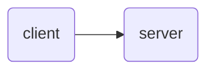
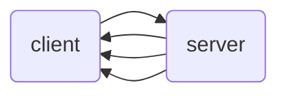
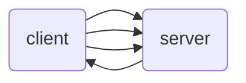
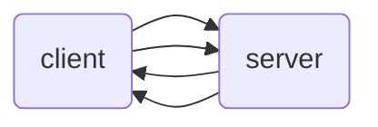

# full-cycle-gRPC
This project  was developed in order to learn GRPC communication  at Full-Cycle's course.

It implements the grpc protocol at Go language, according the below communication workflows.

### Http Request


### Server Stream


### Client Stream

### Bi-directional Stream


### Requirements

It is necessary that a golang version installed above 1.16 at your machine.


### How to run

### Generate gRPC files from protobuff

```Shell

protoc --proto_path=proto proto/*.proto --go_out=pb --go-grpc_out=pb

```

### Run server
```Shell

go run cmd/server/server.go        
```

### Run client
```Shell

go run cmd/server/server.go        
```
